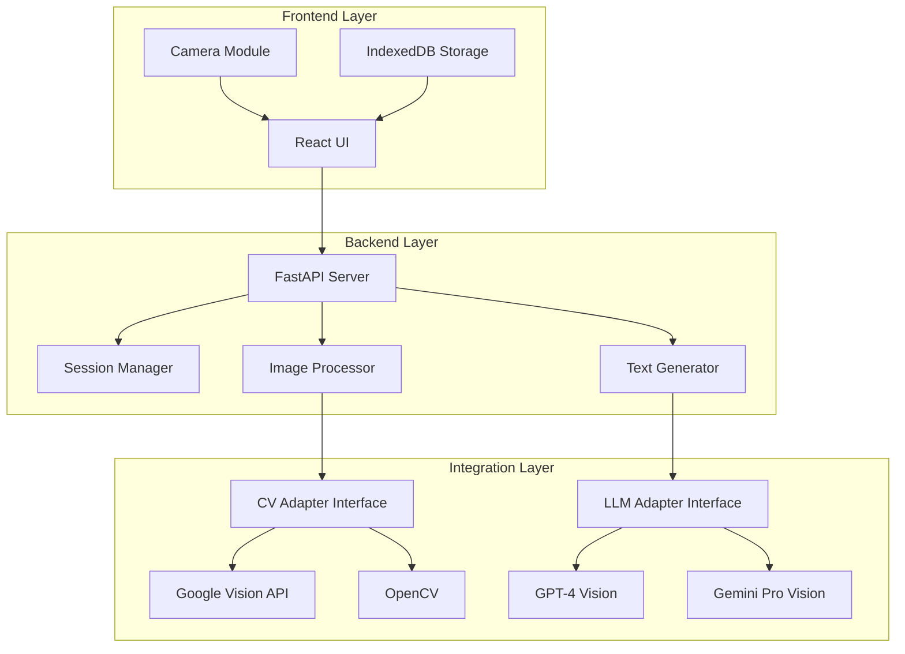

# Документ проектирования

## Обзор

«Визуальный Сомелье» — это приложение, которое использует компьютерное зрение и большие языковые модели для помощи пользователям в понимании сложных бытовых устройств. Система анализирует изображения устройств, идентифицирует элементы управления и предоставляет понятные объяснения на естественном языке.

Приложение будет реализовано как веб-приложение с адаптивным интерфейсом, работающее на мобильных устройствах и десктопах. Это обеспечит максимальную доступность без необходимости установки из магазинов приложений.

## Архитектура

Система построена на трехуровневой архитектуре:

### Уровень представления (Frontend)
- **Технология**: React с TypeScript
- **UI Framework**: Tailwind CSS для адаптивного дизайна
- **Камера**: WebRTC API для доступа к камере устройства
- **Состояние**: Zustand для управления состоянием приложения
- **Хранилище**: IndexedDB для локального хранения истории и кэша

### Уровень бизнес-логики (Backend)
- **Технология**: Python с FastAPI
- **Архитектурный паттерн**: Clean Architecture с разделением на слои
- **API**: RESTful API для синхронных операций
- **Валидация**: Pydantic для валидации данных

### Уровень интеграции (External Services)
- **CV Provider**: Google Cloud Vision API (основной), с возможностью переключения на OpenCV
- **LLM Provider**: OpenAI GPT-4 Vision API (основной), с возможностью переключения на Google Gemini Pro Vision
- **Хранилище изображений**: Локальное хранилище с опциональной интеграцией облачного хранилища

### Диаграмма архитектуры



## Компоненты и интерфейсы

### Frontend компоненты

#### 1. CameraCapture
**Назначение**: Управление камерой и захват изображений

**Интерфейс**:
```typescript
interface CameraCapture {
  startCamera(): Promise<void>;
  stopCamera(): void;
  captureImage(): Promise<Blob>;
  switchCamera(): void; // Переключение между фронтальной и задней камерой
  isActive: boolean;
}
```

#### 2. ImageUploader
**Назначение**: Загрузка изображений из галереи

**Интерфейс**:
```typescript
interface ImageUploader {
  selectImage(): Promise<File>;
  validateImage(file: File): boolean;
  compressImage(file: File, maxSize: number): Promise<Blob>;
}
```

#### 3. DeviceIdentifier
**Назначение**: Отображение результатов идентификации устройства

**Интерфейс**:
```typescript
interface DeviceInfo {
  deviceType: string;
  confidence: number;
  suggestedCategories?: string[];
}

interface DeviceIdentifier {
  displayDeviceInfo(info: DeviceInfo): void;
  allowManualSelection(): Promise<string>;
}
```

#### 4. ExplanationView
**Назначение**: Отображение объяснений и инструкций

**Интерфейс**:
```typescript
interface Explanation {
  text: string;
  steps?: Step[];
  warnings?: string[];
  highlightedAreas?: BoundingBox[];
}

interface ExplanationView {
  displayExplanation(explanation: Explanation): void;
  markStepComplete(stepIndex: number): void;
  requestClarification(stepIndex: number): Promise<string>;
}
```

#### 5. HistoryManager
**Назначение**: Управление историей сессий

**Интерфейс**:
```typescript
interface Session {
  id: string;
  timestamp: Date;
  deviceImage: Blob;
  deviceType: string;
  conversation: Message[];
}

interface HistoryManager {
  saveSession(session: Session): Promise<void>;
  loadSessions(): Promise<Session[]>;
  deleteSession(id: string): Promise<void>;
  restoreSession(id: string): Promise<Session>;
}
```

### Backend компоненты

#### 1. ImageAnalysisService
**Назначение**: Координация анализа изображений

**Интерфейс**:
```python
class ImageAnalysisService:
    def analyze_device(self, image: bytes) -> DeviceAnalysisResult:
        """Анализирует изображение и идентифицирует устройство"""
        pass
    
    def detect_controls(self, image: bytes, device_type: str) -> List[Control]:
        """Обнаруживает элементы управления на изображении"""
        pass
    
    def highlight_area(self, image: bytes, coordinates: BoundingBox) -> bytes:
        """Выделяет область на изображении"""
        pass
```

#### 2. ExplanationService
**Назначение**: Генерация объяснений с использованием LLM

**Интерфейс**:
```python
class ExplanationService:
    def generate_explanation(
        self, 
        image: bytes, 
        question: str, 
        device_context: DeviceContext,
        language: str
    ) -> Explanation:
        """Генерирует объяснение на основе изображения и вопроса"""
        pass
    
    def generate_instructions(
        self, 
        task: str, 
        device_context: DeviceContext,
        language: str
    ) -> List[Step]:
        """Генерирует пошаговые инструкции для задачи"""
        pass
    
    def clarify_step(
        self, 
        step: Step, 
        question: str,
        language: str
    ) -> str:
        """Предоставляет дополнительные разъяснения для шага"""
        pass
```

#### 3. SessionService
**Назначение**: Управление сессиями пользователей

**Интерфейс**:
```python
class SessionService:
    def create_session(self, user_id: str, device_image: bytes) -> Session:
        """Создает новую сессию"""
        pass
    
    def add_message(self, session_id: str, message: Message) -> None:
        """Добавляет сообщение в сессию"""
        pass
    
    def get_session_context(self, session_id: str) -> SessionContext:
        """Получает контекст сессии для LLM"""
        pass
```

### Integration Layer - Адаптеры

#### 1. CVProviderAdapter (Абстрактный интерфейс)
**Назначение**: Единый интерфейс для провайдеров компьютерного зрения

**Интерфейс**:
```python
from abc import ABC, abstractmethod

class CVProviderAdapter(ABC):
    @abstractmethod
    def detect_labels(self, image: bytes) -> List[Label]:
        """Обнаруживает объекты и метки на изображении"""
        pass
    
    @abstractmethod
    def detect_text(self, image: bytes) -> List[TextAnnotation]:
        """Распознает текст на изображении"""
        pass
    
    @abstractmethod
    def detect_objects(self, image: bytes) -> List[DetectedObject]:
        """Обнаруживает объекты с координатами"""
        pass
```

**Реализации**:
- `GoogleVisionAdapter`: Использует Google Cloud Vision API
- `OpenCVAdapter`: Использует локальный OpenCV (для офлайн-режима)

#### 2. LLMProviderAdapter (Абстрактный интерфейс)
**Назначение**: Единый интерфейс для провайдеров LLM

**Интерфейс**:
```python
from abc import ABC, abstractmethod

class LLMProviderAdapter(ABC):
    @abstractmethod
    def generate_completion(
        self, 
        prompt: str, 
        image: Optional[bytes],
        language: str,
        max_tokens: int
    ) -> str:
        """Генерирует текстовый ответ"""
        pass
    
    @abstractmethod
    def generate_structured_output(
        self, 
        prompt: str, 
        schema: dict,
        language: str
    ) -> dict:
        """Генерирует структурированный ответ по схеме"""
        pass
```

**Реализации**:
- `OpenAIAdapter`: Использует GPT-4 Vision API
- `GeminiAdapter`: Использует Google Gemini Pro Vision API

## Модели данных

### DeviceAnalysisResult
```python
from pydantic import BaseModel
from typing import List, Optional

class DeviceAnalysisResult(BaseModel):
    device_type: str
    confidence: float  # 0.0 - 1.0
    brand: Optional[str]
    model: Optional[str]
    suggested_categories: List[str]
    detected_controls: List[Control]
```

### Control
```python
class Control(BaseModel):
    id: str
    type: str  # button, knob, switch, lever, etc.
    label: Optional[str]
    bounding_box: BoundingBox
    confidence: float
```

### BoundingBox
```python
class BoundingBox(BaseModel):
    x: float
    y: float
    width: float
    height: float
```

### Message
```python
from enum import Enum

class MessageRole(str, Enum):
    USER = "user"
    ASSISTANT = "assistant"
    SYSTEM = "system"

class Message(BaseModel):
    role: MessageRole
    content: str
    timestamp: datetime
    image_ref: Optional[str]  # Ссылка на изображение, если есть
```

### Session
```python
class Session(BaseModel):
    id: str
    user_id: str
    device_type: str
    device_image_url: str
    messages: List[Message]
    created_at: datetime
    updated_at: datetime
    device_context: DeviceContext
```

### DeviceContext
```python
class DeviceContext(BaseModel):
    device_type: str
    brand: Optional[str]
    model: Optional[str]
    detected_controls: List[Control]
    safety_warnings: List[str]
```

### Explanation
```python
class Step(BaseModel):
    number: int
    description: str
    warning: Optional[str]
    highlighted_area: Optional[BoundingBox]
    completed: bool = False

class Explanation(BaseModel):
    text: str
    steps: Optional[List[Step]]
    warnings: List[str]
    confidence: float
    sources: List[str]  # Ссылки на источники информации
```

## Свойства корректности

*Свойство — это характеристика или поведение, которое должно выполняться во всех допустимых выполнениях системы — по сути, формальное утверждение о том, что должна делать система. Свойства служат мостом между спецификациями, понятными человеку, и гарантиями корректности, проверяемыми машиной.*

